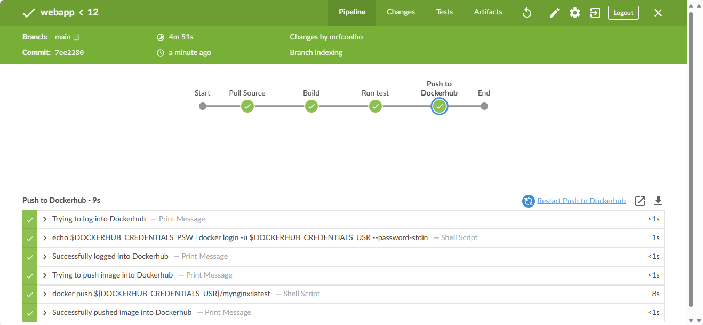

# webapp
Simple nginx server showing customized index page

## Web Application
To build the image simply run the following inside app directory
```
docker build -t mynginx .
```

## Docker Compose
To build the image and launch a container with it run the following inside main directory
```
docker-compose up --build -d
```

## Jenkins Pipeline
The following steps were considered:
* pull source code from github
* build docker image
* run basic health check
* push docker image to dockerhub

The pipeline as described above was tested as shown in the following print:


The image created can be pulled from [a dockerhub](https://hub.docker.com/r/mrfcoelho/mynginx) using:
```
docker pull mrfcoelho/mynginx
```